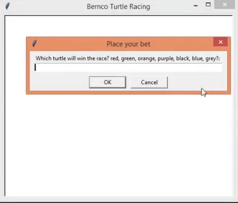

# turtle-Racing-game
<b /> Multiple instances of an object.

<b /> These objects can act and behave differently (states).

<b /> This racing game is a simple code for having the insight on how different objects created from a blue print can behave differently.

<b /> It consists of 7 turtles of different colors and different positions.

<b /> The random number was used to randomly increase the paces of random turtles by 20 paces.

<b /> The winning turtle is printed once it reaches the end of the screen.

<b /> At first you as a player will place your bet as to which turtle will win the race.

